# hse_nosql

PS Данные синтетические (поэтому выглядят странно). Генерацию можно посмотреть в ./data_generator.py
# Типовые запросы
## Топ-5 студентов факультета по среднему баллу
Можем взять любой факультет (Я взял айдишку полиметала)
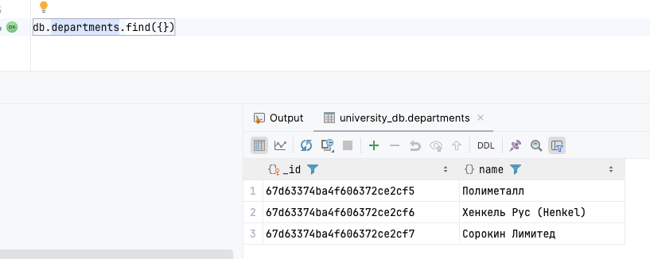
Потом считатем 
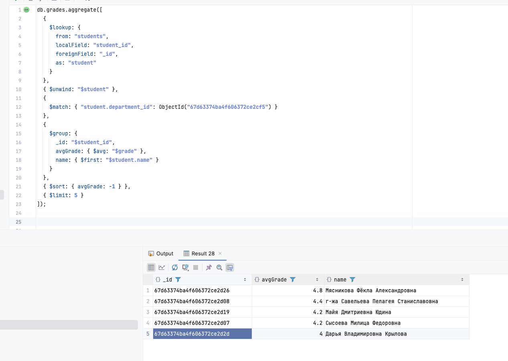
## Посмотреть сколько студентов ходят на курсы
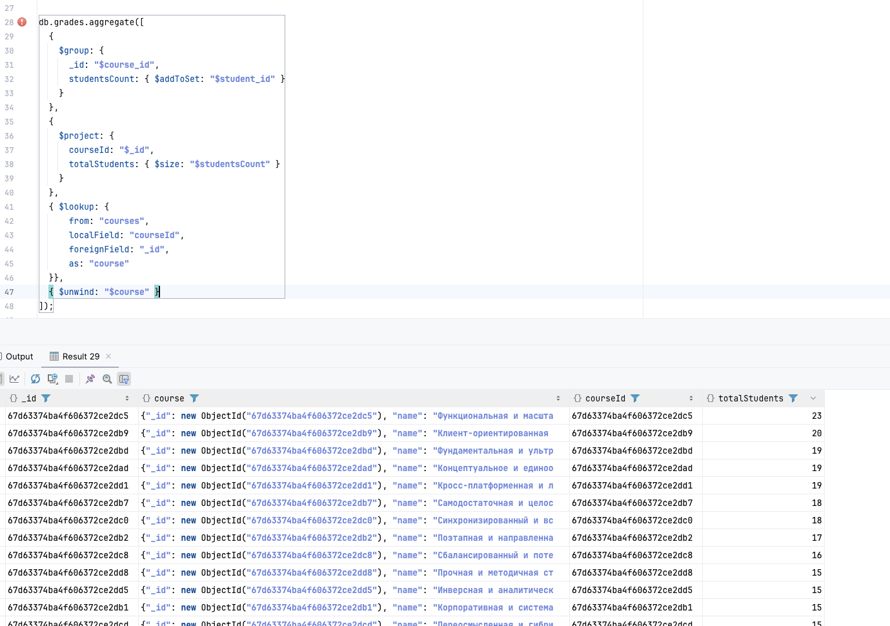
## Посмотреть какие оценки на курсе
Берем айдишку курса. Я взял (Поэтапная и направленная политика)
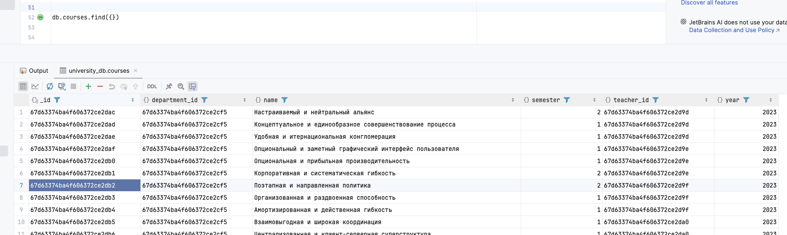
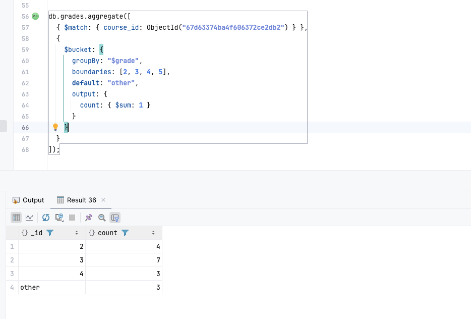
## Посмотреть сколько стуентов у преподаваталей
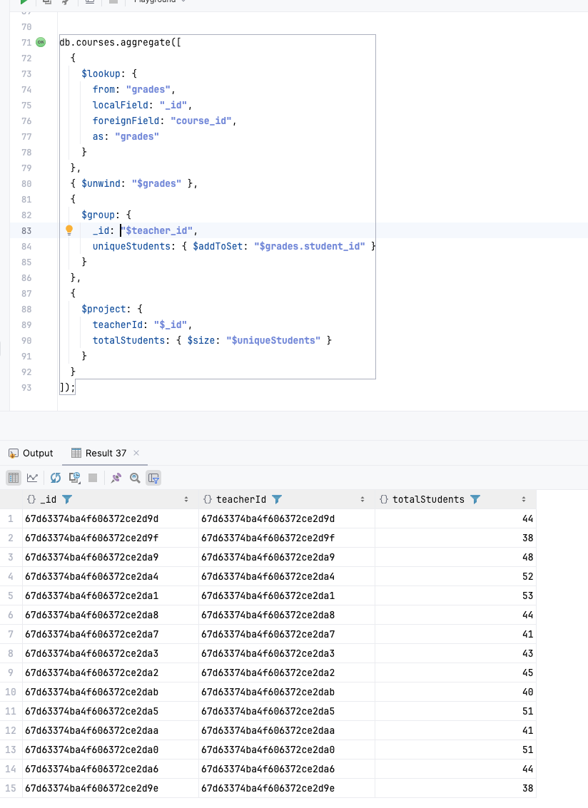
## Посмотреть у каких студентов нет оценок 
У всех есть!
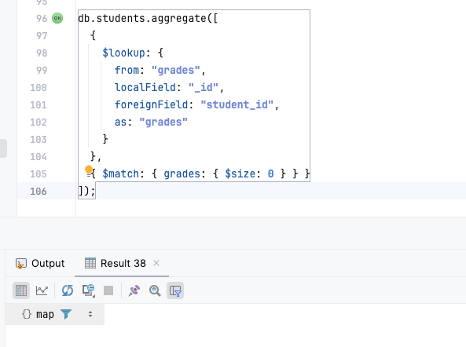
## Посмотреть статистику по факультетам 
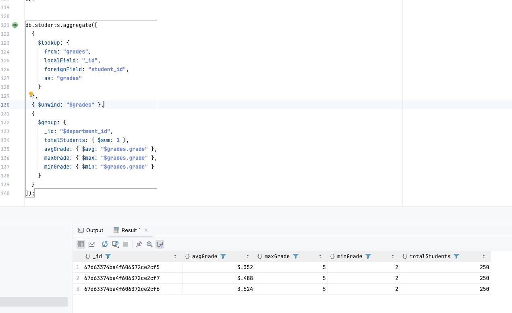
## Посмотреть успеваемость по семестрам 
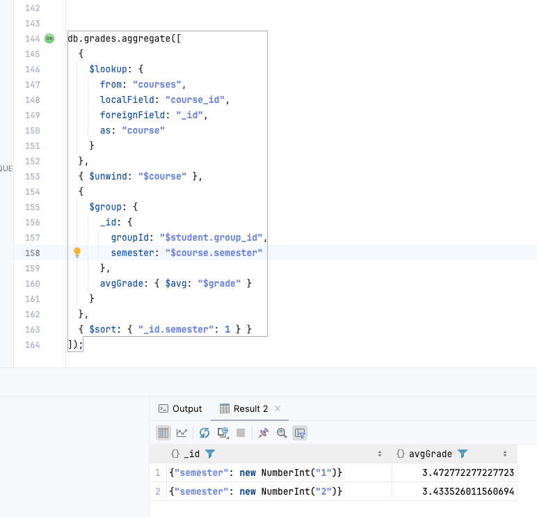
## Поискать аномалии в оценках с помощью трех сигм
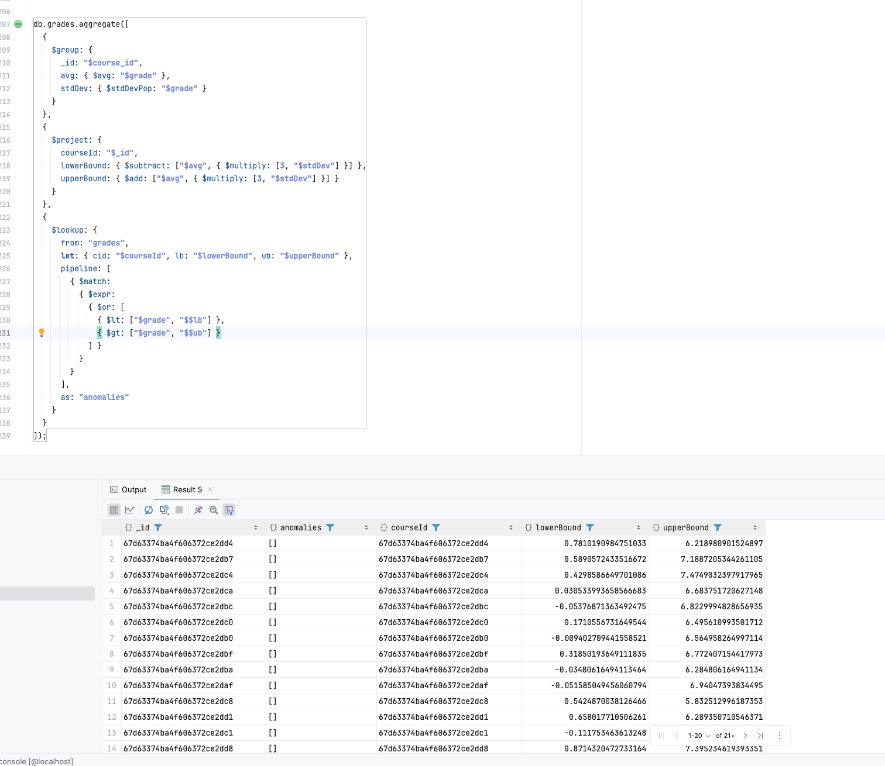
## Можно обновить расписание 
### как было 
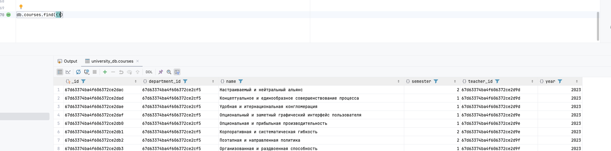
### исполняем 
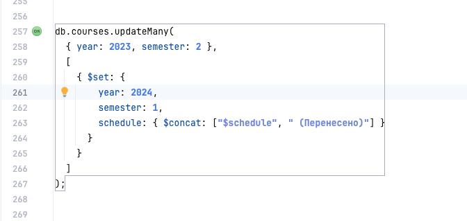
### получаем 
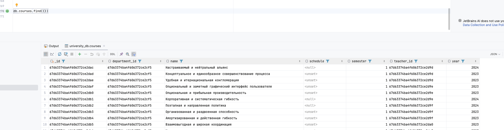