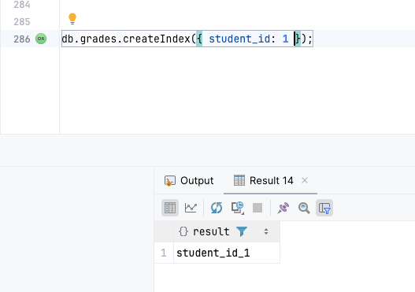
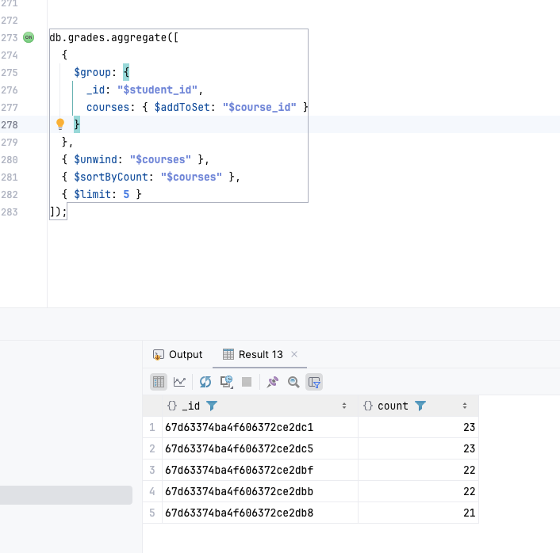

# Структура базы данных
## Таблицы 
### students
Хранит данные о студентах.
```
{
  _id: ObjectId,
  name: String,
  email: String,
  group_id: ObjectId, // Ссылка на группу
  department_id: ObjectId // Ссылка на факультет
}
```
### teachers
Содержит информацию о преподавателях.
```
{
  _id: ObjectId,
  name: String,
  department_id: ObjectId // Ссылка на факультет
}
```

### courses
Описывает учебные курсы.
```
{
  _id: ObjectId,
  name: String,
  teacher_id: ObjectId, // Ссылка на преподавателя
  department_id: ObjectId,
  semester: Number,
  year: Number
}
```

### grades
Фиксирует оценки студентов.
```
{
  _id: ObjectId,
  student_id: ObjectId,
  course_id: ObjectId,
  grade: Number,
  date: Date
}
```

### departments
Список факультетов.
```
{
  _id: ObjectId,
  name: String
}
```
### groups
Учебные группы.
```
{
  _id: ObjectId,
  name: String,
  department_id: ObjectId
}
```

# Индексы 
Они создаются одинаково, поэтому просто сделал для всех вот так


- grades.student_id (поиск оценок студента).
- grades.course_id (поиск оценок по курсу).
- students.group_id (фильтрация студентов по группе).
- courses.teacher_id (поиск курсов преподавателя).
- Составной индекс grades.student_id + grades.course_id 

# Типовые запросы
PS Данные синтетические (поэтому выглядят странно). Генерацию можно посмотреть в ./data_generator.py
## Топ-5 студентов факультета по среднему баллу
Можем взять любой факультет (Я взял айдишку полиметала)

Потом считатем 

## Посмотреть сколько студентов ходят на курсы

## Посмотреть какие оценки на курсе
Берем айдишку курса. Я взял (Поэтапная и направленная политика)


## Посмотреть сколько стуентов у преподаваталей

## Посмотреть у каких студентов нет оценок 
У всех есть!

## Посмотреть статистику по факультетам 

## Посмотреть успеваемость по семестрам 

## Поискать аномалии в оценках с помощью трех сигм

## Можно обновить расписание 
### как было 

### исполняем 

### получаем 

### Самые популярные курсы 
